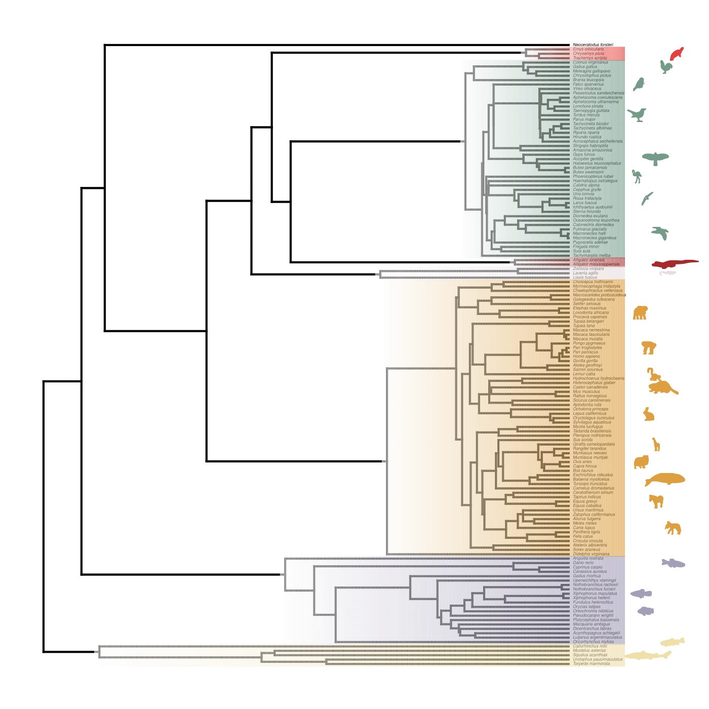

<p align = "justify">

<font size="5"> Data analysis for: </font>

<font size="4"> Why are telomeres the length that they are? Insight from a phylogenetic comparative analysis </font>
</p>

</p></p>

Workflow of the analyses produced by [Dylan J. Padilla Perez](https://dylanpadilla.netlify.app/), School of Life Sciences, Arizona State University, Tempe, AZ 85287, USA.
</p></p>

<b>
<font size="3"> Library </font>
</b>


```{r, include = FALSE}

knitr::opts_chunk$set(comment = ">", fig.width = 7, fig.height = 7, dpi = 300)

```


```{r}

library(AICcmodavg)
library(ape)
library(caper)
library(car)
library(coda)
library(extrafont)
library(geiger)
library(kableExtra)
library(MuMIn)
library(nlme)
library(pbapply)
library(phylopath)
library(phytools)
library(plotrix)
library(rphylopic)
library(scales)
library(shape)
library(xtable)

```

```{r}

R.version
sessionInfo()

```

```{r}


set.seed(80)

## Dataset

data <- read.csv("new_data_2024.csv")
str(data)
head(data)

unique(data$Class)

dat <- data
names(dat)
dat$log_mass <- log1p(dat$Adult_mass_grams)
dat$log_mass

dat[dat$Average_Telomere_Length_kb > 200, ]
#str(dat)

dat <- dat[!dat$Scientific_name == "Sorex_granarius", ] ## potential outlier


rownames(dat) <- dat$Scientific_name
head(dat)

## Trees

full_data_tree <- read.tree("spp.tree.nwk")
is.ultrametric(full_data_tree)
full_data_tree <- force.ultrametric(full_data_tree)
is.ultrametric(full_data_tree)
full_data_tree


## Full_tree

full_data_tree$tip.label

check <- name.check(full_data_tree, dat)
rm_phy <- check$tree_not_data
rm_dat <- check$data_not_tree
pruned_data_tree <- drop.tip(full_data_tree, rm_phy)
pruned_dat <- subset(dat, subset = dat$Scientific_name %in% pruned_data_tree$tip, select = names(dat))
str(pruned_dat)
head(pruned_dat)
pruned_data_tree

name.check(pruned_data_tree, pruned_dat)


hist(pruned_dat$Lifespan_years, main = "raw variable")
hist(log1p(pruned_dat$Lifespan_years), main = "log-transformed")
names(pruned_dat)

pruned_dat$log.lifespan <- log1p(pruned_dat$Lifespan_years)
pruned_dat$log.lifespan


```

<br><br>
<b>
<font size="3"> Figure 1 </font>
</b>


```{r}


#fonts()

#png("figure1.png", width = 7, height = 7, units = "in", res = 360)
#pdf("figure1.pdf")

par(family = "Monaco")
plot(NA, type = "n", xaxt = "n", ylab = "", xlab = "", xlim = c(0, 5), ylim = c(0, 5), axes = FALSE)
box()
text(x = 2.5, y = 5, "Body size", cex = 1.4)
text(x = 0.5, y = 0.5, "Lifespan", cex = 1.4)
text(x = 4.5, y = 0.5, "Endothermy", cex = 1.4)
text(x = 2.5, y = 2.5, "Telomere\nlength", cex = 1.4)

Arrows(2.1, 4.8, 0.7, 0.7, lwd = 2, code = 3, arr.adj = 2, arr.type="triangle", srt= 50, col = "gray")
Arrows(3, 4.8, 4.5, 0.7, lwd = 2, code = 3, arr.adj = 2, arr.type="triangle", srt= 50, col = "gray")
Arrows(1.2, 0.5, 3.5, 0.5, lwd = 2, code = 3, arr.adj = 2, arr.type="triangle", srt= 50, col = "gray")

Arrows(1, 0.7, 2.3, 2, lwd = 2, code = 2, arr.adj = 2, arr.type="triangle", srt= 50)
Arrows(3.9, 0.7, 2.7, 2, lwd = 2, code = 2, arr.adj = 2, arr.type="triangle", srt= 50)
Arrows(2.5, 4.8, 2.5, 2.8, lwd = 2, code = 2, arr.adj = 2, arr.type="triangle", srt= 50)

##dev.off()


```

<br><br>
<b>
<font size="3"> Figure 2 </font>
</b>


```{r, eval = FALSE}


#png("figure2.png", width = 7, height = 7, units = "in", res = 360)
#pdf("figure2.pdf")

plotTree(pruned_data_tree, fsize = 0.25, ftype = "i", mar = c(1, 1, 1, 3))

cladebox <- function(tree, node, spp, ysize, color,...){
    obj <- get("last_plot.phylo", envir = .PlotPhyloEnv)
    h <- max(nodeHeights(tree))
    parent <- tree$edge[which(tree$edge[ , 2] == node), 1]
    x0 <- max(c(obj$xx[node] + obj$xx[parent])/2, obj$xx[node]-0.01*h)
    x1 <- obj$x.lim[2]
    dd <- getDescendants(tree, node)
    y0 <- min(range(obj$yy[dd]))-0.6
    y1 <- max(range(obj$yy[dd]))+0.6
    cols <- colorRampPalette(c("white", color))(100)
    x0 <- seq(x0, x1, length.out = 101)[1:100]
    x1 <- seq(x0[1], x1, length.out = 101)[2:101]
    for(j in 1:100){
        polygon(c(x0[j], x1[j], x1[j], x0[j]), c(y0, y0, y1, y1), col = make.transparent(cols[j], 0.6),
                border = 0)
    }
    
    spp <- gsub("_", " ", as.character(spp))
    x2<- runif(100, obj$x.lim[2] + 10, obj$x.lim[2]+50)
    y3 <- seq(y0, y1, 5)
   
    for(i in spp){
        x2
        uuid <- get_uuid(name = i, n = 1)
        img <- get_phylopic(uuid = uuid)
        i <- gsub(" ", "_", i) ## This is actually not required as I think rphylopic can get spp names with "_"
        nodes <- sapply(i, grep, x = tree$tip.label)
        for(j in nodes){
            add_phylopic_base(img = img, x = sample(x2, 1), y = j, ysize = ysize, color = color, fill = color)
        }
       
    }

}

#nodelabels(cex = 0.5)

chel.spp <- pruned_dat$Scientific_name[pruned_dat$Class == "Reptilia"][8]
bird.spp <- pruned_dat$Scientific_name[pruned_dat$Class == "Aves"][c(4, 10, 11, 12, 27, 28, 5)]
alg.spp <- pruned_dat$Scientific_name[pruned_dat$Class == "Reptilia"][2]
squ.spp <- pruned_dat$Scientific_name[pruned_dat$Class == "Reptilia"][4]
mammal.spp <- pruned_dat$Scientific_name[pruned_dat$Class == "Mammalia"][c(4, 5, 2, 16, 30, 37, 47, 53, 55, 49)]
ost.spp <- pruned_dat$Scientific_name[pruned_dat$Class == "Fish"][c(7, 4, 8)]
chon.spp <- pruned_dat$Scientific_name[pruned_dat$Class == "Fish"][c(19, 24)]

cladebox(pruned_data_tree, 282, spp = chel.spp, 3, color = "#e93e3a")
cladebox(pruned_data_tree, 238, spp = bird.spp, 3, color = "#759c8a")
cladebox(pruned_data_tree, 237, spp = alg.spp, 2, color = "brown")
cladebox(pruned_data_tree, 233, spp = squ.spp, 1, color = "#e7dddf")
cladebox(pruned_data_tree, 170, spp = mammal.spp, 3, color = "#dd9f40")
cladebox(pruned_data_tree, 149, spp = ost.spp, 2, color = "#a39db8")
cladebox(pruned_data_tree, 144, spp = chon.spp, 2,  color = "#efe0a8")


#dev.off()


```





```{r}

## PGLS models

names(pruned_dat)
pruned_dat$new.log.TL <- log(pruned_dat$Average_Telomere_Length_kb)
pruned_dat$new.log.TL

model1 <- gls(new.log.TL ~ log_mass + log.lifespan + Endo_ectotherm + log_mass:log.lifespan + log_mass:Endo_ectotherm + log.lifespan:Endo_ectotherm + log_mass:log.lifespan:Endo_ectotherm, correlation = corBrownian(phy = pruned_data_tree, form = ~Scientific_name), data = pruned_dat, method = "ML")
summary(model1)

model2 <- update(model1, ~ .-log_mass:log.lifespan:Endo_ectotherm)
summary(model2)

model3 <- update(model2, ~ .-log.lifespan:Endo_ectotherm)
summary(model3)

model4 <- update(model3, ~ .-log_mass:log.lifespan)
summary(model4)

model5 <- update(model4, ~ .-log_mass:Endo_ectotherm)
summary(model5)

model6 <- update(model5, ~ .-Endo_ectotherm)
summary(model6)

model7 <- update(model6, ~ .-log_mass)
summary(model7)


## Model diagnosis


layout(matrix(c(0, 0, 0, 0,
                1, 1, 2, 2,
                1, 1, 2, 2,
                0, 0, 0, 0), nrow = 4, ncol = 4, byrow = TRUE))


## Checking homogeneity of variance


plot(fitted(model7), resid(model7), col = "grey", pch = 20, xlab = "Fitted", ylab = "Residual", main = "Fitted versus Residuals")
abline(h = 0, col = "darkorange", lwd = 2)


## Checking normality

qqnorm(resid(model7), col = "darkgrey")
qqline(resid(model7), col = "dodgerblue", lwd = 2)


```

<br><br>
<b>
<font size="3"> Figure 5 </font>
</b>


```{r}


#png("figure3.png", width = 7, height = 7, units = "in", res = 360)
#pdf("figure3.pdf")


par(mar = c(5, 4, 1, 4))

plot(new.log.TL ~ log.lifespan , data = pruned_dat, pch = 21, bg = c(alpha("purple", 0.5), alpha("orange", 0.5), alpha("pink", 0.7), alpha("gold", 0.5))[as.numeric(as.factor(pruned_dat$Class))], col = c(alpha("purple", 0.5), alpha("orange", 0.5), alpha("pink", 0.7), alpha("gold", 0.5))[as.numeric(as.factor(pruned_dat$Class))], las = 1, xlab = "Log lifespan (yrs)", ylab = "Log telomere length (kb)", type = "n")

grid(nx = NULL, ny = NULL, col = "lightgray", lwd = 1)

par(new = TRUE)

plot(new.log.TL ~ log.lifespan , data = pruned_dat, pch = 21, bg = c(alpha("purple", 0.5), alpha("orange", 0.5), alpha("pink", 0.7), alpha("gold", 0.5))[as.numeric(as.factor(pruned_dat$Class))], col = c(alpha("purple", 0.5), alpha("orange", 0.5), alpha("pink", 0.7), alpha("gold", 0.5))[as.numeric(as.factor(pruned_dat$Class))], las = 1, xlab = "Log lifespan (yrs)", ylab = "Log telomere length (kb)")

par(xpd = TRUE)

uuid.aves <- get_uuid(name = "Accipiter_gentilis", n = 1)
img.aves <- get_phylopic(uuid = uuid.aves)
add_phylopic_base(img = img.aves, x = 6, y = 2.4, ysize = 0.1, col = alpha("purple", 0.5), fill = alpha("purple", 0.5))

uuid.fish <- get_uuid(name = "Oreochromis niloticus", n = 1)
img.fish <- get_phylopic(uuid = uuid.fish)
add_phylopic_base(img = img.fish, x = 6, y = 2.2, ysize = 0.09, col = alpha("orange", 0.5), fill = alpha("orange", 0.5))

uuid.mammals <- get_uuid(name = "Elephas_maximus", n = 1)
img.mammals <- get_phylopic(uuid = uuid.mammals)
add_phylopic_base(img = img.mammals, x = 6, y = 2, ysize = 0.2, col = alpha("pink", 0.7), fill = alpha("pink", 0.7), horizontal = TRUE)

uuid.reptilia <- get_uuid(name = "Alligator_mississippiensis", n = 1)
img.reptilia <- get_phylopic(uuid = uuid.reptilia)
add_phylopic_base(img = img.reptilia, x = 6, y = 1.8, ysize = 0.1, col = alpha("gold", 0.5), fill = alpha("gold", 0.5))


SSX <- sum(round((pruned_dat$new.log.TL - mean(pruned_dat$new.log.TL))^2), 2)
s2 <- var(pruned_dat$new.log.TL)
n <- length(pruned_dat$new.log.TL)
x <- seq(min(pruned_dat$log.lifespan), max(pruned_dat$log.lifespan), 0.06)
m.x <- mean(round(pruned_dat$new.log.TL, 1))
se <- sqrt(s2*((1/n) + (((x - m.x)^2)/SSX)))
is <- qt(0.975, df = n - 2)
ii <- qt(0.025, df = n - 2)
ic.s <- se*is
ic.i <- se*ii
upper.i <- (coef(model7)[1] + coef(model7)[2]*x) + ic.s
lower.i <- (coef(model7)[1] + coef(model7)[2]*x) + ic.i

##par(new = TRUE)

lines(x = x, y = (coef(model7)[1] + (coef(model7)[2]*x)), lwd = 2, col = alpha("black", 0.5))

polygon(c(rev(x), x), c(rev(lower.i), upper.i), border = FALSE, col = alpha("gold", 0.3))


```


<b>
<font size="3"> Figure 4 </font>
</b>


```{r}

## Phylogenetic signal (Blomberg et al.'s K statitics

telo.length <- setNames(pruned_dat$new.log.TL, rownames(pruned_dat))
telo.length

k_tl <- phylosig(pruned_data_tree, telo.length, test = TRUE, nsim = 10000)
attributes(k_tl)
head(k_tl$sim.K)
k_tl$K
k_tl$P


#png("figure4.png", width = 7, height = 7, units = "in", res = 360)
#pdf("figure4.pdf")

hist(k_tl$sim.K, bty = "o", ylim = c(0, 3000), las = 1, ylab = "Null distribution of K", xlab = "K", main = "")
abline(v = k_tl$K, lwd = 2, lty = "dotted")
text(x = k_tl$K - 0.02, y = 2500, "Observed value \n of K")
box()

#dev.off()


## PGLS models within classes

## Mammals

pruned_tree_mammals <- drop.tip(pruned_data_tree, pruned_dat$Scientific_name[!pruned_dat$Class == "Mammalia"])

name.check(pruned_tree_mammals, data = pruned_dat[pruned_dat$Class == "Mammalia", ])


model8 <- gls(new.log.TL ~ log_mass + log.lifespan + log_mass:log.lifespan, correlation = corBrownian(phy = pruned_tree_mammals, form = ~Scientific_name), data = pruned_dat[pruned_dat$Class == "Mammalia", ], method = "ML")
summary(model8)

model9 <- update(model8, ~ .-log_mass:log.lifespan)
summary(model9)

model10 <- update(model9, ~ .-log.lifespan)
summary(model10)

```


```{r}

## Birds + Reptiles

bird.reptiles <- rbind(pruned_dat[pruned_dat$Class == "Aves", ], pruned_dat[pruned_dat$Class == "Reptilia", ])

pruned_dat_minus_bird.reptiles <- pruned_dat[!pruned_dat$Scientific_name %in% bird.reptiles$Scientific_name, ]

pruned_tree_bird.reptiles <- drop.tip(pruned_data_tree, pruned_dat_minus_bird.reptiles$Scientific_name)
name.check(pruned_tree_bird.reptiles, bird.reptiles)

model11 <- gls(new.log.TL ~ log_mass + log.lifespan + Endo_ectotherm + log_mass:log.lifespan + log_mass:Endo_ectotherm + log.lifespan:Endo_ectotherm + log_mass:log.lifespan:Endo_ectotherm, correlation = corBrownian(phy = pruned_tree_bird.reptiles, form = ~Scientific_name), data = bird.reptiles, method = "ML")
summary(model11)

model12 <- update(model11, ~ .-log_mass:log.lifespan:Endo_ectotherm)
summary(model12)

model13 <- update(model12, ~ .-log.lifespan:Endo_ectotherm)
summary(model13)

model14 <- update(model13, ~ .-log_mass:log.lifespan)
summary(model14)

model15 <- update(model14, ~ .-log_mass:Endo_ectotherm)
summary(model15)

model16 <- update(model15, ~ .-Endo_ectotherm)
summary(model16)

model17 <- update(model16, ~ .-log_mass)
summary(model17)


```


```{r}


## Fish

pruned_tree_fish <- drop.tip(pruned_data_tree, pruned_dat$Scientific_name[!pruned_dat$Class == "Fish"])
name.check(pruned_tree_fish, data = pruned_dat[pruned_dat$Class == "Fish", ])

model18 <- gls(new.log.TL ~ log_mass + log.lifespan + log_mass:log.lifespan, correlation = corBrownian(phy = pruned_tree_fish, form = ~Scientific_name), data = pruned_dat[pruned_dat$Class == "Fish", ], method = "ML")
summary(model18)

model19 <- update(model18, ~ .-log_mass:log.lifespan)
summary(model19)

model20 <- update(model19, ~ .-log.lifespan)
summary(model20)

```


```{r}


pruned_dat$Telomerase_activity[pruned_dat$Telomerase_activity == 0] <- "absent"
pruned_dat$Telomerase_activity[pruned_dat$Telomerase_activity == 1] <- "present"
pruned_dat$Telomerase_activity[is.na(pruned_dat$Telomerase_activity)] <- "N/A"

tel.act <- setNames(pruned_dat$Telomerase_activity, rownames(pruned_dat))
tel.act

TA <- to.matrix(tel.act, unique(tel.act))
TA <- TA[pruned_data_tree$tip.label, ]

life.span <- setNames(pruned_dat$log.lifespan, rownames(pruned_dat))
log_mass <- setNames(pruned_dat$log_mass, rownames(pruned_dat))
telo.length <- setNames(pruned_dat$new.log.TL, rownames(pruned_dat))


```


```{r}


plotTree(pruned_data_tree, ftype = "off", mar = c(3, 2, 2, 3))

tiplabels(pie = TA, piecol = c("white", "gray", "black"), cex = 0.22, offset = 4.3)

par(xpd = TRUE)

legend(x = 150, y = 0.2, legend = unique(tel.act), pch = 21, pt.bg = c("white", "gray", "black"), pt.cex = 1, bty = "n", title = "Telomerase activity", cex = 0.7, horiz = TRUE)


par(new = TRUE)
par(mar = c(3, 32, 2, 1.1))
barplot(life.span[pruned_data_tree$tip.label], horiz = TRUE, width = 1, space = 0,
        ylim = c(1, length(pruned_data_tree$tip.label))-0.5, names = "", las = 2, cex.axis = 0.5, axes = FALSE)

axis(1, at = round(seq(min(life.span), max(life.span), 1.5), 1), labels = FALSE)
text(round(seq(min(life.span), max(life.span), 1.5), 1), par("usr")[3] - 0.2, labels = round(seq(min(life.span), max(life.span), 1.5), 1), srt = 50, pos = 1, xpd = TRUE, cex = 0.5, offset = 1)
mtext("Lifespan \n (years)", side = 1, line = 1.6, cex = 0.5, font = 2)


```

<br><br>
<b>
<font size="3"> Figure 3 </font>
</b>


```{r}

## Ancestral state reconstruction of telomere size

fit <- fastAnc(pruned_data_tree, telo.length, vars = TRUE, CI = TRUE)

fit$CI[1, ]
obj <- contMap(pruned_data_tree, telo.length, plot = FALSE)


##png("figure5.png", width = 7, height = 7, units = "in", res = 360)
##pdf("figure5.pdf")


plot(obj, ftype = "off", legend = FALSE, ylim = c(1-0.09*(Ntip(obj$tree)-1), Ntip(obj$tree)), mar = c(1, 0.1, 1, 5), lwd = 1.5)
add.color.bar(150, obj$cols,title = "Log telomere length (kb)", lims = obj$lims, digits = 3, prompt = FALSE, x = 0,
              y = 1-0.08*(Ntip(obj$tree)-1), lwd = 4, fsize = 0.6, subtitle = "")

tiplabels(pie = TA, piecol = c("white", "gray", "black"), cex = 0.16, offset = 5.7)
legend(x = 200, y = -5, legend = unique(tel.act), pch = 21, pt.bg = c("white", "gray", "black"), pt.cex = 1, bty = "n", title = "Telomerase activity", cex = 0.7, horiz = TRUE)

par(new = TRUE)
par(mar = c(3.6, 29.7, 3, 3))

barplot(life.span[pruned_data_tree$tip.label], horiz = TRUE, width = 1.07, space = 0,
        ylim = c(1, length(pruned_data_tree$tip.label))-0.5, names = "", las = 2, cex.axis = 0.5, axes = FALSE)

axis(1, at = round(seq(min(life.span), max(life.span), 1.5), 1), labels = FALSE)
text(round(seq(min(life.span), max(life.span), 1.5), 1), par("usr")[3] - 0.2, labels = round(seq(min(life.span), max(life.span), 1.5), 1), srt = 50, pos = 1, xpd = TRUE, cex = 0.5, offset = 1)
mtext("Log lifespan \n (years)", side = 1, line = 1.6, cex = 0.5, font = 2)

par(new = TRUE)
par(mar = c(3.6, 32.2, 3, 0.5))

barplot(log_mass[pruned_data_tree$tip.label], horiz = TRUE, width = 1.07, space = 0,
        ylim = c(1, length(pruned_data_tree$tip.label))-0.5, names = "", las = 2, cex.axis = 0.5, axes = FALSE)

axis(1, at = round(seq(min(log_mass), max(log_mass), 5), 1), labels = FALSE)
text(round(seq(min(log_mass), max(log_mass), 5), 1), par("usr")[3] - 0.2, labels = round(seq(min(log_mass), max(log_mass), 5), 1), srt = 50, pos = 1, xpd = TRUE, cex = 0.5, offset = 1)
mtext("Log mass \n (gr)", side = 1, line = 1.6, cex = 0.5, font = 2)

##dev.off()


```


```{r}

## Correlated evolution under the threshold model


## Removing NAs from the dataset

pruned_dat$Telomerase_activity

pruned_dat_not_NAs <- pruned_dat[!pruned_dat$Telomerase_activity == "N/A", ]
pruned_dat_not_NAs$Telomerase_activity

check2 <- name.check(pruned_data_tree, pruned_dat_not_NAs)
rm_phy2 <- check2$tree_not_data
rm_dat2 <- check2$data_not_tree
pruned_data_tree_not_NAs <- drop.tip(pruned_data_tree, rm_phy2)
pruned_dat_not_NAs <- subset(pruned_dat_not_NAs, subset = pruned_dat_not_NAs$Scientific_name %in% pruned_data_tree_not_NAs$tip, select = names(pruned_dat_not_NAs))

pruned_dat_not_NAs$Telomerase_activity <- as.factor(pruned_dat_not_NAs$Telomerase_activity)
str(pruned_dat_not_NAs)
head(pruned_dat_not_NAs)
pruned_data_tree_not_NAs

name.check(pruned_data_tree_not_NAs, pruned_dat_not_NAs)

names(pruned_dat_not_NAs)

## Set the number of generations

ngen <- 5e6

## Run MCMC

mcmc.model <- threshBayes(pruned_data_tree_not_NAs, pruned_dat_not_NAs[ , c(17, 18)], type = c("cont", "disc"), ngen = ngen,
                          plot = FALSE, control = list(print.interval = 5e+05))


mcmc.model


## Pull out the post burn-in sample and compute HPD

r.mcmc <- tail(mcmc.model$par$r, 0.8*nrow(mcmc.model$par))
class(r.mcmc) <- "mcmc"

hpd.r <- HPDinterval(r.mcmc)
hpd.r

```

<br><br>
<b>
<font size="3"> Figure S1 </font>
</b>


```{r}

## Profile plots from a Bayesian MCMC analysis of the threshold model

#png("figureS1.png", width = 7, height = 7, units = "in", res = 360)
#pdf("figureS1.pdf")
plot(mcmc.model)
#dev.off()


```


<br><br>
<b>
<font size="3"> Figure 6 </font>
</b>


```{r}

## Plot posterior density

#png("figure6.png", width = 7, height = 7, units = "in", res = 360)
#pdf("figure6.pdf")


par(las = 1)
plot(density(mcmc.model), xlim = c(-1, 1.5))

## add whiskers to show HPD

h <- 0-par()$usr[3]
lines(x = hpd.r, y = rep(-h/2, 2))
lines(x = rep(hpd.r[1], 2), y = c(-0.3, -0.7)*h)
lines(x = rep(hpd.r[2], 2), y = c(-0.3, -0.7)*h)
box()

##dev.off()


```
